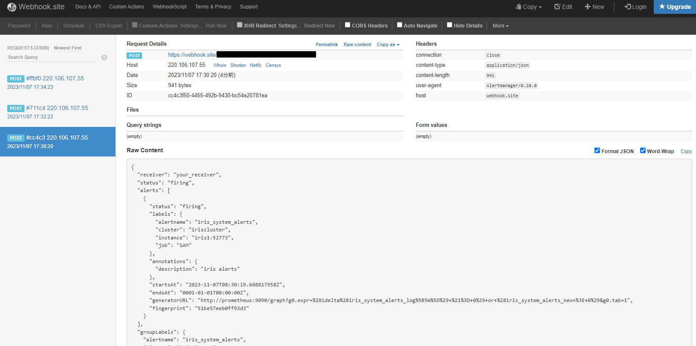

# Prometheus and Grafana only
prometheus + Grafanaだけ(SAM無し)で監視する試み。
dockerのvolumeもbind mountのみを使用するように変更。cpfや各コンフィグ用途に使用。

利便性等のために、[grafana.ini](config/grafana/grafana.ini)をあれこれ(編集を許可、URLなど)変更している。[SAM用のもの](../sam-2.0.1.181-unix/config/grafana/grafana.ini)と比較すると変更点がわかる。

```
$ diff sam-2.0.1.181-unix/config/grafana/grafana.ini nosam-2.0.1.181/config/grafana/grafana.ini
48c48
< root_url = %(protocol)s://%(domain)s:%(http_port)s/api/sam/grafana
---
> root_url = %(protocol)s://%(domain)s:%(http_port)s/
263c263
< viewers_can_edit = false
---
> viewers_can_edit = true
266c266
< editors_can_admin = false
---
> editors_can_admin = true
276c276
< disable_login_form = true
---
> disable_login_form = false
279c279
< disable_signout_menu = true
---
> disable_signout_menu = false
$
```

# 準備
元々は、SAM(IRIS)に向いていたalertの送信先が必要になる。

[webhook.site](https://webhook.site/)を利用する。起動する前に、同サイトにて自分用のURLを取得し、[isc_alertmanager.yml](config/alertmanager/isc_alertmanager.yml)のurlを「Your unique URL」で上書き保存する。

```
- name: 'isc_sam_default'
  webhook_configs:
  - url: https://webhook.site/xxxxx-xxx-xxxx-xxxx-xxxxxxx
```

# 起動
```
$ cd nosam-2.0.1.181
$ docker compose up -d
$ docker compose ps --services
alertmanager
grafana
iris1
iris2
nginx
node-exporter
prometheus
```
iris1, iris2,node-exporterが監視対象になります。


# 各種エンドポイント

## node exporter

Prometeusテスト用のメトリック収集
```
$ curl http://localhost:9100/metrics
   ・
   ・
# TYPE node_cpu_seconds_total counter
node_cpu_seconds_total{cpu="0",mode="idle"} 227229.61
node_cpu_seconds_total{cpu="0",mode="iowait"} 425.96
node_cpu_seconds_total{cpu="0",mode="irq"} 0
node_cpu_seconds_total{cpu="0",mode="nice"} 59.25
node_cpu_seconds_total{cpu="0",mode="softirq"} 191.11
node_cpu_seconds_total{cpu="0",mode="steal"} 0
node_cpu_seconds_total{cpu="0",mode="system"} 311.73
node_cpu_seconds_total{cpu="0",mode="user"} 608.48
node_cpu_seconds_total{cpu="1",mode="idle"} 226832.41
node_cpu_seconds_total{cpu="1",mode="iowait"} 103.55
node_cpu_seconds_total{cpu="1",mode="irq"} 0
   ・
   ・
```

# 参考
https://amateur-engineer-blog.com/getting-started-prometheus/

## IRIS metrics endpoint   

iris1の52773ポートはコンテナ実行ホストの52773にパブリッシュしています。

```
$ curl http://localhost:52773/api/monitor/metrics
   ・
   ・
iris_glo_a_seize_per_sec 0
iris_glo_n_seize_per_sec 0
iris_glo_ref_per_sec 116
iris_glo_ref_rem_per_sec 0
iris_glo_seize_per_sec 0
iris_glo_update_per_sec 20
iris_glo_update_rem_per_sec 0
   ・
   ・
$
```

(prometheusコンテナ内からは http://iris1:52773/api/monitor/metrics, http://iris2:52773/api/monitor/metrics  ) 

## IRIS alert endpoint

```
$ curl http://localhost:52773/api/monitor/alerts
[]
$ curl -s http://localhost:52773/api/monitor/metrics | grep alert
iris_system_alerts 0
iris_system_alerts_log 0
iris_system_alerts_new 0
```

強制的にアラートレベルのメッセージを送信することで、アラートのテストができます。
```
$ docker compose exec iris1 iris session iris
USER>Do ##class(%SYS.System).WriteToConsoleLog("Severe error xxx",,2)
USER>Do ##class(%SYS.System).WriteToConsoleLog("Severe error yyy",,2)
USER>h

$ curl -s http://localhost:52773/api/monitor/metrics | grep alert
iris_system_alerts 2
iris_system_alerts_log 2
iris_system_alerts_new 1

$ curl http://localhost:52773/api/monitor/alerts
[{"time":"2023-11-07T08:24:59.045Z","severity":"2","message":"Severe error xxx"},{"time":"2023-11-07T08:25:42.027Z","severity":"2","message":"Severe error yyy"}]
$
```
一度alertsを取得すると、再取得されなくなる。また、metricsの_newが0に戻る。(つまり_newは未取得のalert件数)

```
$ curl http://localhost:52773/api/monitor/alerts
[]
$ curl -s http://localhost:52773/api/monitor/metrics | grep alert
iris_system_alerts 2
iris_system_alerts_log 2
iris_system_alerts_new 0
```


## prometheus U/I

取得対象の表示

http://localhost:9090/targets


http://localhost:9090/

node exporterの例
```
Expression: rate(node_cpu_seconds_total{mode="system"}[1m]) 
「Execute」を押下。

Element	Value
{cpu="0",instance="node:9100",job="node-exporter",mode="system"}	0.02222222222222222
{cpu="1",instance="node:9100",job="node-exporter",mode="system"}	0.015111111111111263
{cpu="2",instance="node:9100",job="node-exporter",mode="system"}	0.01644444444444433
{cpu="3",instance="node:9100",job="node-exporter",mode="system"}	0.025777777777777698

```

IRISの例
```
Expression: iris_glo_ref_per_sec{instance="iris1:52773"}[30s]
Consoleに切り替えて、「Execute」を押下。

iris_glo_ref_per_sec{cluster="iriscluster",instance="iris1:52773",job="SAM"}	
154 @1699336158.778
148 @1699336173.779

Expression: avg_over_time(iris_glo_ref_per_sec{instance="iris1:52773"}[30s])
「Execute」を押下。

Element                                                  Value
{cluster="iriscluster",instance="iris1:52773",job="SAM"}	156  <==上記2ポイントの平均

Graphに切り替え
```


PromQLを使用。
https://qiita.com/tatsurou313/items/64fcaae3567f24d13dd5

アラート(件数)の表示

http://localhost:9090/alerts

## Grafana U/I
http://localhost:3000

Home→SAM Managerフォルダ→SAM Dashboardを選ぶとダッシュボードが表示できる。


## alertmanager

http://localhost:9093  

prometheusのalertmanagerはアラート発生時にその情報を送信する先(mailやwebhook)を要する。SAMでは送信先がSAM用のirisインスタンスになっているが、ここではひとまず[webhook.site](https://webhook.site/)を利用している。

alertが発生すると、[このような](alert.json)がPOSTされるので、受信側はこの情報からalertの取得先URL(*)を生成し、必要な操作を行います。
> (*)アラート発生源の"instance": "iris1:52773"なので、iris1インスタンスのURL+/api/monitor/alerts  
> iris1はdocker-compose でport:52773で公開しているので、URLは、http://localhost:52773/api/monitor/alerts になる。


先ほどと同様に強制的にアラートレベルのメッセージを送信することで、alertmanagerのテストができます。
```
$ docker compose exec iris1 iris session iris
USER>Do ##class(%SYS.System).WriteToConsoleLog("Severe error xxx",,2)
USER>h

$ curl -s http://localhost:52773/api/monitor/metrics | grep alert
iris_system_alerts 3
iris_system_alerts_log 3
iris_system_alerts_new 1
```

この時点で、アラート情報がhttps://webhook.site/ にPOSTされているはずです。




